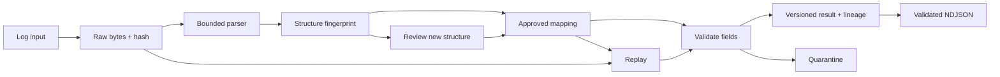

# TraceWeave architecture

Universal Log Pre-processing Framework. Updated September 20, 2026. The two-page handout is available at [TraceWeave-Architecture.pdf](../output/pdf/TraceWeave-Architecture.pdf); pagination and both rendered pages have been checked.

September 21 hosting addition: Render Free serves the same review workflow and
saved model. Supabase Auth gates private workspaces; an owner-scoped, revision-checked
snapshot saves originals, results, contracts and audit history before acknowledging
writes. Hosted storage is bounded to 1,000 records / 8 MB per user. Local deployment
remains offline-capable. [HOSTING.md](HOSTING.md) documents this extension; the PDF
handout currently describes the earlier local deployment and optional export.

## Problem and architectural decision

Perimeter-device logs differ across vendors and firmware. Incorrect interpretation can break security analytics even when the input parses successfully. TraceWeave preserves accepted raw records and treats normalized data as versioned interpretations, with explicit review when a source structure changes.

Two differentiators: field-level source lineage attached to a reviewed mapping contract; and a single workflow connecting drift detection, correction, replay, and rollback. Automatic parsing and raw retention already exist in mature tools; our advantage is the complete, demonstrable workflow.

## Implemented components

- **Ingest and raw store:** local text/file upload; original bytes, SHA-256, source identifier and receipt time stored in SQLite before interpretation. Oversized requests are rejected before acceptance.
- **Parsing:** bounded JSON, KV, Syslog/KV, CEF, LEEF 1.0, flat XML and one-row CSV adapters; initial FortiGate, pfSense filterlog and Suricata EVE profiles. Unsupported/ambiguous records retain raw evidence and error reasons.
- **Contract registry:** source name plus format/key/type fingerprint identifies a structure. Mappings are reviewed and versioned. Aliases propose mappings without inventing semantics.
- **Validation:** IP addresses, ports, known action/protocol vocabulary and explicit timestamp timezone. Required fields depend on event class: firewall decisions require addresses and action, while passive connections/alerts do not acquire invented verdicts. Unknown extra fields remain available.
- **AI assistance:** a 16,448-parameter field classifier trained on AMD RX 6500M via DirectML proposes unfamiliar generic mappings after aliases. Vendor profiles take priority, uncertain suggestions abstain, and every new structure requires review. Training is GPU-only; portable runtime inference uses the saved JSON weights locally.
- **Replay and provenance:** retain each result revision. Each normalized field records a source selector, original value, transform version, raw hash and contract version. JSON selectors use JSON Pointer. Approval replays affected records; rollback restores the prior contract and appends new result revisions.
- **UI and export:** an empty initial workspace with Add logs → Review fields → Export flow; source summaries and decision activity; 25-row pagination, source/status/text filters and 10-second state refresh. Field settings, raw-byte downloads and technical history are available in the detail dialog. Candidate values are identified as unapproved. All actions use the local API; unavailable connections show an error, never a simulated response. Static hosting cannot execute the backend.
- **Optional cloud export:** explicit, bounded Supabase uploads of reviewed revisions including raw evidence. Server-only credentials, RLS/restricted grants, stable workspace/revision IDs and local receipts support safe retries. Cloud operation is optional and disabled until configured; it is not a full workspace backup.

## Data model and runtime

`events` stores raw bytes and identity; `contracts` stores mapping versions; `results` stores interpreted revisions; `audit` stores approval/rollback records. Stable event IDs join them. No result deletes or overwrites an older interpretation through the application.

Runtime: Python 3.11+, standard library, SQLite, and local HTML/CSS/JavaScript. Included model weights need no framework installation. No paid API, cloud service or GPU is required to use the saved model. GPU training uses an isolated DirectML environment. The server binds loopback and validates request origin/host. Input sizes are bounded; untrusted text is escaped in the UI. This is a single-user application, without enterprise authentication or tamper-proof storage.

## Verification and constraints

The supplied unit tests cover preservation, invalid records, duplicate fields, drift, contract isolation, replay, rollback and persistence. A 240-record synthetic evaluation improves valid normalization from 120 before review to 240 after one supplied field mapping. All four negative fixtures are excluded; all 1,252 retained benchmark records verify. Human onboarding time and external vendor accuracy are unmeasured.

The schema is `traceweave.network/0.1`, not validated OCSF. Structural drift detection cannot establish a same-shaped semantic change. Full vendor grammars, arbitrary proprietary formats, OCSF integration and distributed durability remain future work. The AI's small authored holdout produced 39 correct suggestions, two incorrect suggestions and 19 abstentions; this does not establish production accuracy.

## Scale path

At one billion events/day, average ingest is about 11,574 events/second. Production requires durable collectors, partitioned queues, immutable raw object storage, stateless parsing/mapping workers, a contract registry, quarantine queues and columnar output. Add backpressure, idempotent processing, replay checkpoints and retention policies. Replace the prototype's single server, per-record commits and full-history reads. Benchmark end-to-end durability and recovery before making scale claims.

Reviewed validation gates control promotion of the included model's restricted suggestions. A future manual-grounded proposer needs independent evaluation; there are no LLM calls in the required path.
