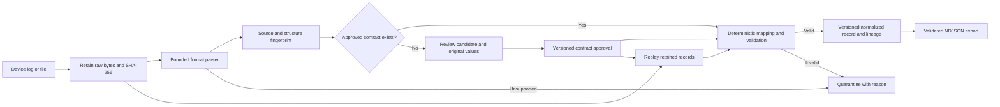

# TraceWeave: problem selection and solution strategy

Decision date: 19 September 2026. Selected challenge: **SIH26156, Universal Log Pre-processing Framework**. Sponsor in the supplied workbook: National Technical Research Organisation (NTRO).

Build a free, offline framework that preserves original perimeter-device events, translates approved fields into a common schema, and recovers safely when a device changes its log format. The working prototype is in this workspace. This document distinguishes source requirements, architectural proposals, and implemented behavior.

The competitive opportunity is a visibly complete **detect, review, replay, verify** workflow. Automatic parsing, schema mapping, and raw retention already exist in mature products. Our claim is a focused hackathon advantage through a rigorous demonstration and reproducible evidence, not a first-ever invention or guaranteed win.

## 1. What the attachments establish

### Workbook inventory and provenance

`SIH_2026_Problem_Statements_Selected (1).xlsx` contains two visible sheets, no cell formulas, and seven selected problem statements. `Problem Statements!A1:J8` contains IDs, titles, descriptions, sponsor, department, category, theme, resource pointers, and submission counts. `Source & Notes!A1:B19` describes the compilation. The cell-addressed extraction and input SHA-256 hashes are retained in [input_extract.json](evidence/input_extract.json). The workbook has not been modified.

All seven entries are software challenges from NTRO. The source notes date the main mirror snapshot to 3 September 2026, the cross-check to 22 August, and compilation to 18 September. The stated submission counts total 114 across these seven rows; they are historical snapshot counts, not current competitor counts or measures of team quality.

The [official 2026 portal](https://sih.gov.in/sih2026PS) could not be retrieved during research. Both workbook-named mirrors were accessible: [primary mirror](https://github.com/vedantchalke36/sih-2026-problem-statements) and [cross-check mirror](https://github.com/NoBugNinja/Smart-India-Hackathon-SIH-2026-Problem-Statements). This does not establish that the current official wording, availability, deadlines, or counts remain unchanged. Confirm those before submitting.

Data-quality findings:

- `H4`, under “Youtube Link,” actually contains an NCIIPC contact pointer, not a video. There are **zero actual video URLs** in the seven rows.
- Three dataset cells are populated (`I2`, `I3`, `I5`), but they are resource descriptions, a Drive pointer, and a dataset list. They are not three ready-to-use datasets. The drone attachment was not fetched because that candidate was excluded at the feasibility gate.
- The notes say contact information is populated for zero records, but contact text appears in `H4` and `I5`. There is no dedicated contact column in the main table.
- Some descriptions contain replacement characters around bullets. The original strings are preserved in the extraction rather than silently repaired.
- The drone description contains the placeholder “Add 'Desired Output' and 'Evaluation Criteria' table here.” Its missing table is a material specification gap.

### Image interpretation

The attached JPEG is a seven-row comparison labelled “Overall statistics,” not an official judging rubric. It does not identify its scorer, method, or evidence. Difficulty is a cost, not a benefit. Its values are transcribed below exactly; they are useful priors but not independent measurements.

| ID | Image feasibility | Viability | Effectiveness | Difficulty | Workbook submissions |
| --- | ---: | ---: | ---: | ---: | ---: |
| SIH26161 | 6 | 9 | 9 | 10 | 8 |
| SIH26158 | 4 | 9 | 8 | 10 | 20 |
| SIH26156 | 9 | 10 | 9 | 8 | 13 |
| SIH26153 | 6 | 9 | 9 | 10 | 22 |
| SIH26152 | 5 | 7 | 7 | 9 | 23 |
| SIH26151 | 4 | 8 | 8 | 10 | 11 |
| SIH26149 | 8 | 9 | 9 | 8 | 17 |

The image supports investigating SIH26156 first. It understates some delivery risks: SIH26149 asks for broad storage sanitization and fragmented recovery; a unified GUI alone does not satisfy those requirements.

### Screening all seven choices

| Challenge | Non-negotiable requirements from workbook | Decisive constraint under a free local build |
| --- | --- | --- |
| **26156: logs** (`C4`) | Raw preservation, traceability, normalization, onboarding, perimeter-device scope, air-gap operation; production architecture for billions/day | Ground truth can be authored for a narrow prototype. Vendor breadth and scale still need validation. **Select.** |
| 26153: attack forecasting (`C5`) | Both packet and flow features; learned state transitions; K-step forecasting; attack-stage mapping; offline inference; baseline comparison; weights and training scripts | Dataset timelines do not automatically provide valid future attack-stage labels. Leakage and causal overclaims are major risks. Runner-up. |
| 26149: erasure/recovery (`C8`) | Drive and selective erasure, metadata cleansing, fragmented carving, multiple media/filesystems, verification and reporting | A disk-image prototype is feasible, but SSD erasure guarantees and damaged-media reconstruction need hardware and expertise. Third candidate. |
| 26161: dam inundation (`C2`) | Both SPH and “Delf3D” comparison, Indian river/dam demo, DEM/hydrology/imagery, GIS exports and Earth Engine analysis | Two numerical models, terrain inputs, boundary conditions, and validation exceed the reliable free prototype scope without a hydrology specialist. A flood-map animation would miss the requirement. |
| 26158: single-pass reconstruction (`C3`) | Video, GPS and flight metadata; metric/georeferenced output; occlusion handling and near-real-time ambition | Single-view ambiguities cannot be resolved just by a visually attractive reconstruction. No supplied video, calibration, metric ground truth, or complete evaluation table. |
| 26152: social analytics (`C6`) | X and Telegram essential; sentiment, demographics, trends, chronology, network analysis | Essential platform access is unresolved. Aggregate demographic ground truth is missing. A sentiment dashboard would cover only part of the challenge. |
| 26151: attribution (`C7`) | Multi-source collection, infrastructure indicators, identity graph, persona linkage, confidence and exports | No authorized evaluation corpus or verified identity ground truth supplied. False linkage would invalidate the demonstration. Exclude from the build. |

For the dam candidate, Deltares documents that the [Delft3D engines are available as source](https://oss.deltares.nl/web/riverlab-models/delft3d), but compilation, model setup, and credible calibration remain work. For sanitization, the applicable NIST reference is [SP 800-88 Rev. 2, published September 2025](https://csrc.nist.gov/pubs/sp/800/88/r2/final); do not build a claim around the superseded revision. For forecasting, [CICIDS2017 provides scheduled attacks, PCAPs, and labelled flows](https://www.unb.ca/cic/datasets/ids-2017.html), which still require careful state-label construction and time-separated evaluation.

## 2. Candidate ranking

The following are architect estimates under the user's constraints: **all free, built here**, ordinary CPU hardware, and no paid API dependency. A 48-hour hackathon prototype window is a planning assumption, not a user-confirmed deadline. Novelty means differentiation from existing approaches; moat means difficulty of copying the complete evidence and operating workflow; feasibility means delivering a credible core; judging impact means requirement coverage plus a clear demonstration. None is an official score or probability of winning.

Weighted score = 30% novelty + 25% moat + 25% feasibility + 20% judging impact. Candidates with feasibility below 5/10 are excluded before ranking. Uncertainty is roughly ±1 per dimension; the small score gaps should not be interpreted as precision.

| Rank | Problem angle | Novelty | Moat | Feasibility | Judging impact | Weighted /10 |
| --- | --- | ---: | ---: | ---: | ---: | ---: |
| **1** | **26156: verified log interpretation with drift recovery and replay** | **8** | **7** | **9** | **9** | **8.20** |
| 2 | 26153: calibrated multi-step attack forecasting with explicit “unknown stage” and leakage-resistant evaluation | 8 | 8 | 5 | 9 | 7.45 |
| 3 | 26149: evidence-preserving disk-image recovery plus a separate, capability-aware sanitization workflow | 7 | 7 | 6 | 8 | 6.95 |

Why each angle matters:

1. **Logs:** exploit the gap between successful parsing and trustworthy interpretation. A judge can deliberately change a field and inspect exactly what happens. The free core needs no trained model or inaccessible data.
2. **Forecasting:** distinguish a forecast from a classifier by withholding future information, forecasting multiple horizons, calibrating uncertainty, and measuring lead time at a fixed false-positive rate. The moat is a trustworthy benchmark and temporal representation. The prerequisite is a usable dataset with defensible stage labels.
3. **Erasure/recovery:** make the device capability and verification evidence first-class; separate read-only recovery from destructive sanitization. Demonstrate carving on disposable images and document unsupported media. This is credible but full challenge coverage is harder than the image's 8/10 feasibility suggests.

The ranking is not a popularity contest. The lowest snapshot count belongs to the dam challenge, whose modelling obligations are much harder. If judged only on novelty and moat, logs and forecasting tie at 7.5; the current recommendation depends on feasibility. Equal weights still rank logs first (8.25 versus 7.50 and 7.00). A domain partner with verified attack timelines could materially improve the runner-up.

## 3. Stakeholders, constraints, and judging evidence

Primary operator: a SOC data engineer onboarding firewall, gateway, VPN, or IDS events. Secondary users: incident responders checking original evidence; security architects operating an air-gapped installation; platform owners feeding a SIEM or data lake. The immediate problem is expensive and fragile source integration, with downstream detection errors when fields are lost or interpreted incorrectly.

The workbook is broad in its background but explicitly narrows **current scope to perimeter network devices**. Do not spend the demo on application traces, employee behavior, or a chatbot. Raw bytes are authoritative for retention. The normalized schema is a versioned interpretation. Source/destination semantics require an explicit mapping. No cloud dependency may be necessary for normal operation.

The official [college SPOC guideline search result](https://sih.gov.in/letters/Guidelines-College-SPOC.pdf) mentions novelty, complexity, and clarity. The full PDF could not be retrieved, and the result is not verified as the 2026 rubric. Treat the following as our internal judging map, derived primarily from `C4`:

| Requirement / likely evaluation dimension | Evidence to put in front of the judge |
| --- | --- |
| Novelty and technical depth | Introduce a schema mutation; show a review gate, field lineage, versioned repair and replay |
| Raw preservation and traceability | Download original bytes, verify SHA-256, inspect source selector and original value |
| Plug-and-play onboarding | Import an unfamiliar field vocabulary; map through the UI without editing application code |
| Air-gap feasibility | Run with local assets, SQLite, and Python standard library; no credentials or model downloads |
| Integration and usefulness | Download validated NDJSON and explain the planned OCSF adapter |
| Scale and maintainability | Disclose measured limits; describe partitioning, backpressure, raw archival and stateless workers |
| Clarity and completeness | Two-minute failure-and-recovery demonstration, five-slide outline, reproducible setup and tests |

For SIH26156 specifically, `C4` asks for a source-code link, README, architecture document of at most two pages, demo video of at most two minutes, and technical presentation of at most five slides. Local code and documentation exist. A published repository link, recorded video, and actual slide deck have not been created or submitted.

## 4. Competitor failure analysis

These three submission patterns are strategic hypotheses, not observations of actual 2026 entrants.

| Likely submission | Why it can look strong | Blind spot we can demonstrate | Our response |
| --- | --- | --- | --- |
| Regex/Logstash-style converters and a polished dashboard | Lots of connectors and immediately visible charts | A firmware rename or source-specific action code makes important fields disappear; retention and replay are often omitted from rushed demos | Preserve bytes first; validate against source contracts; review changed structures; replay historical records |
| An LLM that rewrites every event into JSON | Handles a few unfamiliar examples impressively | Ongoing inference cost, offline hardware burden, variable output, ambiguity, and difficult exact provenance | Deterministic execution in the normal path; optional local model only proposes bounded mappings, which must be checked |
| Drain/template clustering plus an anomaly chart | Unsupervised grouping looks like universal understanding | Correctly grouping text templates does not establish source/destination meaning, action vocabulary, or lossless interpretation | Explicit semantic mappings and source lineage; evaluate normalized field correctness and rejected records as well as grouping |

### Actual landscape and limits of our novelty claim

| Existing approach | Verified existing capability | What that means for our positioning |
| --- | --- | --- |
| [Cribl Stream Parser](https://docs.cribl.io/stream/parser-function/) and [Copilot Editor](https://cribl.io/news/cribl-unveils-copilot-editor-ai-powered-capability-to-translate-telemetry-data-into-business-insights/) | Automatic format detection/extraction and AI-assisted schema/pipeline work already exist | “AI universal parser” is not a defensible differentiator. Compare our narrow workflow and open evaluation; do not claim Cribl lacks replay or raw retention without testing it. |
| [Splunk Ingest Processor](https://help.splunk.com/en/data-management/process-data-at-ingest-time/use-ingest-processor/process-data-using-pipelines/extract-fields-from-event-data-using-ingest-processor) | AI-assisted extraction from unstructured logs and standard parsing for structured formats | Generating extraction regex is already established. Judge our evidence, correction workflow, and offline simplicity. |
| [Vector Remap](https://vector.dev/docs/reference/configuration/transforms/remap/) | A purpose-built language for log transformation and explicit error routing | Safe deterministic transformation is mature. A future adapter should reuse it; the prototype is not a performance competitor. |
| [Drain3](https://github.com/logpai/Drain3) | Online template mining and parameter extraction | A useful future clustering component. Template discovery alone is not a complete semantic mapper. |
| [OCSF](https://github.com/ocsf/ocsf-docs/blob/main/overview/understanding-ocsf.md) | A common event schema with raw and unmapped attributes | Raw retention plus a common schema are established concepts. Reuse OCSF for integration instead of inventing a competing industry standard. |

No commercial product was installed or benchmarked. Absence of a feature in the inspected page is not proof that the product lacks it. There is no patent search or basis for exclusivity claims.

## 5. Refined problem statement and unfair advantages

**Refined statement:** Security teams cannot reliably correlate perimeter-device events when each vendor and firmware version describes the same network action differently. Build an offline framework that preserves every accepted raw record, makes every normalized field traceable, and recovers from log-format changes through reviewed, versioned mappings and deterministic replay, so downstream analytics consume validated interpretations.

**Judge-facing pitch:** “Change a device field during the demo. TraceWeave shows which events need review, retains their originals, and applies one reviewed correction to the affected history. Every exported field can be traced back to evidence.”

### Advantage 1: a versioned interpretation contract

Separate raw bytes, parsed attributes, and semantic mappings. A contract defines source selectors, target meanings, allowed transforms, and validation conditions. Each result records its contract version and lineage. New structures wait for review. Type-valid values with unsupported semantics remain unresolved.

Implemented: exact-byte retention, SHA-256, source/structure-specific mappings, IP/port/action/time validation, unmapped fields, historical result revisions, approved-only export. JSON selectors use JSON Pointer to avoid collisions between dotted keys and nesting.

Proposed extension: attach contract test reports, parser-package digests and device-manual references; include byte spans where reliable; validate against a pinned OCSF schema. The current hash checks provide local integrity, not external proof of origin or tamper-proof storage.

### Advantage 2: change detection tied directly to repair and replay

Fingerprint a source's format, field names and field types. When its structure changes, withhold the candidate from validated export. Show original values beside the proposed mapping, validate the correction against affected records, then reprocess retained bytes and preserve older interpretations. Rollback is part of the same workflow.

Implemented: structural drift detection, conservative alias suggestions, explicit UI approval, affected-record replay, validation outcomes and rollback. **Automatic semantic discovery, trained ML, and an LLM agent are not implemented.** A same-shaped change in field meaning may evade structural detection; operator-reviewed contracts and future semantic regression fixtures are still necessary.

Proposed extension: a local proposer uses a source manual plus sample events to emit a restricted mapping, never executable arbitrary code. An independent validator checks contradictions and held-out mutations. Only reviewed contracts enter deterministic execution. An agent is useful here only if it reduces measured review time.

### What makes the moat grow

The present implementation is copyable. The longer-term advantage would be a reusable corpus of device/firmware mappings, their counterexamples, validated corrections, and regression cases linked to downstream query outcomes. This accumulates operational knowledge that a generic prompt or connector list does not provide by itself. An open implementation can still develop that advantage through better coverage and release discipline. Score 7/10 reflects an emerging moat, not an established one.

## 6. Making “10×” an experiment

Primary target: **at least 10× lower median hands-on time to onboard or repair an unfamiliar supported-format source**, at equal normalized-field correctness and preserved raw data. Example target: a 30-minute measured manual baseline versus a 3-minute reviewed mapping. These times are hypotheses, not observed results.

Protocol: give operators the same device manuals, held-out logs, hardware, and target schema. Compare a competent static-parser workflow with TraceWeave. Include at least five source families, field renames, field additions, action-vocabulary changes, key-order changes, invalid ports, duplicate keys, IPv6, and unknown records. Record reviewer time, wrong accepted fields, valid coverage, rejected records, replay time, and the answers to fixed security queries. Split by source/firmware family; do not randomly mix near-duplicate lines across train and test. Freeze the test corpus before tuning.

Success requires: exact raw round trips for all accepted fixtures; zero known invalid records exported in the test set; no increase in semantic errors relative to baseline; and the time target on independent sources. Report numerator/denominator, failures, and timing distribution. A zero error count on a small test set is not a universal zero-error guarantee.

### Results from the build in this workspace

See [benchmark.json](evidence/benchmark.json) for the actual recorded run and its machine details. A controlled 240-record synthetic evaluation contains 120 known-format records and 120 records with a renamed source field. The same parsing and validation code with fixed aliases correctly normalizes 120/240. TraceWeave also normalizes 120/240 before review, then 240/240 after one explicitly supplied mapping. All four adversarial fixtures remain outside validated export; all 1,252 retained benchmark records pass byte-integrity checks.

This demonstrates the recovery mechanism, not superior zero-shot understanding. A well-engineered baseline can also recover after its mapping is changed and history is replayed. Human review time, independent vendor accuracy, durable-storage throughput, and performance against Cribl/Splunk have not been measured. The prototype has not achieved the 10× target.

## 7. Architecture and user experience

The product opens on an event stream with counts that reconcile to retained records. The demo starts with eight events across seven format families. Each event opens a detail view showing original text, exact-byte download, normalized/candidate values, field lineage, unmapped fields, and the mapping editor. A changed source field becomes a visible review task; the user corrects it once and sees the affected records replay. Separate views show active contracts, decision history, and measured evaluation results.

Raw event text is escaped before display. Application assets are local. The server binds loopback, checks request host/origin, limits request sizes, and requires JSON for mutations. There are no external scripts, fonts, network APIs, or credentials. This is a single-user local demonstrator; enterprise authentication and access controls are not implemented.

### Scale without pretending the prototype proves it

One billion events/day is about **11,574 events/second on average**. At an assumed 1 KB raw event, that is roughly **1 TB/day before replication, indices, and normalized copies**. A 3× arrival burst would be about 34,722 events/second. These are sizing assumptions, not measured demand or capacity.

Production proposal: collectors with durable spooling, partitioned ingest by source, immutable raw object storage, stateless parsing/mapping workers, a versioned contract registry, quarantined-event queues, and columnar normalized output. Use backpressure, replay checkpoints, idempotent record identifiers, and explicit retention policies. Benchmark end-to-end durability and recovery before claiming scale. SQLite, single-threaded HTTP, per-record commits, full-history reads and embedded raw copies are deliberate prototype simplifications and must be replaced for production.

## 8. Build scope and execution plan

The core is built now using Python standard library, SQLite and plain HTML/CSS/JavaScript. See [README](../README.md) for startup and [ARCHITECTURE](ARCHITECTURE.md) for a concise design view.

| Capability | Current status |
| --- | --- |
| File/text ingest and raw-byte retrieval | Implemented, bounded local upload |
| JSON, key/value, Syslog with KV payload, CEF subset, LEEF 1.0 subset, flat XML, CSV header plus one row | Implemented with documented restrictions |
| Perimeter network event mapping | Implemented for source/destination IP, ports, action, timestamp, protocol |
| Structural drift, mapping review, replay, revision history and rollback | Implemented |
| Unknown-record retention and validated-only export | Implemented |
| Runtime without paid dependencies or API keys | Implemented |
| Full RFC/vendor grammar coverage, arbitrary proprietary formats | Not implemented |
| Full OCSF validation and SIEM-specific adapters | Planned |
| Local model proposer, manual retrieval and mutation-based promotion gate | Planned |
| Multi-node durability, enterprise access control, signed/WORM evidence storage | Planned |
| Billions/day validation, production deployment, commercial superiority | Not established |

A practical 48-hour refinement sequence, if that is the event window: hours 0–6 validate official requirements and collect sanitized fixtures; 6–16 replace generic samples with three perimeter vendor families; 16–26 add a pinned OCSF adapter and semantic regression cases; 26–34 test replay, invalid inputs and disconnected operation; 34–42 time independent onboarding comparisons; 42–48 freeze the build and rehearse the two-minute demo. If time is short, keep the currently working proof and remove the optional model and distributed stack from the demo.

### Two-minute demonstration

- 0:00–0:15: state the operator problem and load the reviewed synthetic sources.
- 0:15–0:35: open one event; point to original bytes, interpreted fields and lineage.
- 0:35–0:55: change a device format. Show two records withheld for review.
- 0:55–1:20: map `origin` to `src_ip`, approve, and replay. Show the prior revision remains available.
- 1:20–1:40: inject adversarial records. Show why duplicate keys and invalid values are excluded.
- 1:40–2:00: verify raw integrity, export validated events, and state measured results and current limits.

Five-slide outline: (1) operator pain and precise scope; (2) existing landscape and our workflow difference; (3) architecture and provenance example; (4) demonstration plus independently reported metrics; (5) free deployment, scale path, and next validation milestone.

## 9. Resources and decisions still needed

No additional resource, paid account, key, GPU, or dataset was needed for the delivered prototype. Exact current and optional dependencies are in [RESOURCE_MANIFEST.md](RESOURCE_MANIFEST.md).

Before final submission, resolve: current official PS wording and eligibility; event deadline and team skills; three target device vendors/firmware versions; canonical schema/version expected by the sponsor; meanings of unfamiliar action values and timestamps; evaluation hardware; offline installation constraints; and the required retention/access policy. These are validation inputs, not blockers to running the current demonstration.

## 10. Ongoing documentation protocol

Architecture decisions and scope pivots belong in [DECISIONS.md](DECISIONS.md), with context, alternatives, consequence and validation. [WORKFLOW.md](WORKFLOW.md) defines the process. `run.ps1` enables a local watcher that appends changed source/document paths to [CHANGELOG.md](CHANGELOG.md). The watcher records factual file changes; it cannot infer architectural intent, so semantic rationale must be supplied by the author. It creates no scheduled cloud task and transmits no data.
